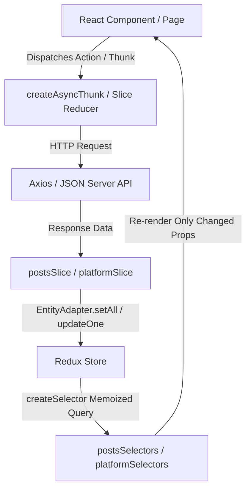

# Redux Content Management Dashboard

A production-quality social media content management web application built with **React 19**, **Redux Toolkit 2.0**, **createEntityAdapter**, **createAsyncThunk**, and **Reselect** memoized selectors.

---

## 🌟 Key Architectural Features

- **Centralized Normalized State**: Uses `createEntityAdapter` for both Posts and Platforms to manage relational entities with `ids` and `entities` mapping.
- **Asynchronous Operations**: Powered by `createAsyncThunk` (`fetchPosts`, `createPost`, `updatePost`, `deletePost`, `changePostStatus`, `fetchPlatforms`).
- **Reselect Derived Selectors**: All statistics and analytics metrics (Posts per platform, published ratios, total engagement) are computed on-the-fly via memoized `createSelector` queries without storing redundant state.
- **Performance Optimizations**: Critical components (e.g. `PostCard`) are memoized using `React.memo`, `useCallback`, and `useMemo` to eliminate unnecessary re-renders.
- **Resilient Mock API Layer**: Built with `axios` and `json-server`, featuring an automatic fallback interceptor so the application functions seamlessly even without an active server.
- **Dark Mode Persistence**: Full dark/light mode theme engine with instant toggle and `localStorage` state persistence.
- **Optimistic Updates & Undo Delete**: Immediate UI response on post deletion backed by a toast notification with a 6-second **Undo** restore capability.
- **Keyboard Shortcuts**: Press `Ctrl + K` for Spotlight Search, `Ctrl + Shift + N` for New Post modal, and `Esc` to close dialogs.

---

## 🚀 Quick Start Guide

### Prerequisites
- Node.js (v18.0.0 or higher)
- npm (v9.0.0 or higher)

### 1. Installation
Clone the repository and install all dependencies:
```bash
npm install
```

### 2. Run Application
Launch both the **Vite Client** (`http://localhost:5173`) and **JSON Server** (`http://localhost:3001`):
```bash
npm start
```
*Alternatively, you can run only the client via `npm run client` (the built-in mock interceptor will automatically handle data requests if JSON server is not running).*

---

## 📁 Project Structure

```
d:/full_stack/post_manager/
├── db.json                      # Mock database for JSON Server
├── index.html                   # HTML entrypoint with font imports
├── package.json                 # Project dependencies & scripts
├── vite.config.js               # Vite build & proxy configuration
└── src/
    ├── app/
    │   └── store.js             # Redux store with configureStore()
    ├── services/
    │   └── api.js               # Axios instance with mock fallback interceptors
    ├── features/
    │   ├── posts/
    │   │   ├── postsSlice.js    # createEntityAdapter & createAsyncThunk
    │   │   ├── postsAPI.js      # CRUD API endpoints
    │   │   ├── postsSelectors.js# Reselect memoized selectors (selectAnalytics, etc.)
    │   │   ├── PostCard.jsx     # React.memo optimized post component
    │   │   ├── PostList.jsx     # Grid/List paginated & infinite view
    │   │   ├── PostFormModal.jsx# Create & Edit modal form
    │   │   └── PostFilterBar.jsx# Search, filters, sorting & mode toggles
    │   ├── platforms/
    │   │   ├── platformSlice.js # Entity adapter for Facebook, Instagram, LinkedIn, etc.
    │   │   ├── platformAPI.js   # Platform sync API endpoints
    │   │   ├── platformSelectors.js # Memoized platform selectors
    │   │   ├── PlatformCard.jsx # Platform management card
    │   │   └── PlatformFormModal.jsx # Platform settings modal
    │   └── ui/
    │       ├── uiSlice.js       # Theme mode, modal state, toasts, lastDeletedPost
    │       └── uiSelectors.js   # UI state selectors
    ├── hooks/
    │   ├── useDebounce.js       # Search input debouncing
    │   ├── useKeyboardShortcuts.js # Keyboard event listener
    │   └── useRedux.js          # Typed Redux hooks
    ├── components/
    │   ├── common/
    │   │   ├── Navbar.jsx       # Header bar with search trigger & theme toggle
    │   │   ├── Sidebar.jsx      # Navigation sidebar with entity badges
    │   │   ├── ToastContainer.jsx # Toast notifications with Undo support
    │   │   ├── ConfirmModal.jsx # Action confirmation dialog
    │   │   ├── GlobalSearchModal.jsx # Spotlight search modal
    │   │   ├── LoadingSkeleton.jsx # Shimmer loader placeholder
    │   │   └── Pagination.jsx   # Page navigation controls
    ├── pages/
    │   ├── DashboardPage.jsx    # Metrics overview & activity stream
    │   ├── PostsPage.jsx        # Content management grid & controls
    │   ├── PlatformsPage.jsx    # Social channels connectivity
    │   ├── AnalyticsPage.jsx    # Reselect-powered intelligence breakdown
    │   └── NotFoundPage.jsx     # 404 Error page
    └── styles/
        ├── variables.css        # CSS Tokens & Dark/Light mode variables
        └── global.css           # Resets, glassmorphism, animations & utility classes
```

---

## 🔄 Redux State Flow



---

## 🎨 App Screenshots

| Dashboard Overview | Content Management |
|:---:|:---:|
|  |  |

| Platform Connectivity | Analytics Intelligence |
|:---:|:---:|
|  |  |

---

## 🔮 Future Improvements

1. **Rich Text Editor**: Integrate Quill/TipTap for WYSIWYG social media post drafting with image uploads.
2. **AI Content Generator**: Embed OpenAI / Gemini SDK to generate post variations based on target platform.
3. **Calendar View**: Add full monthly calendar scheduling view for post drag-and-drop.
4. **WebSocket Integration**: Live real-time metric updates when posts are liked or commented on externally.

---

## 📜 License

MIT © 2026 Redux Content Management Dashboard.
